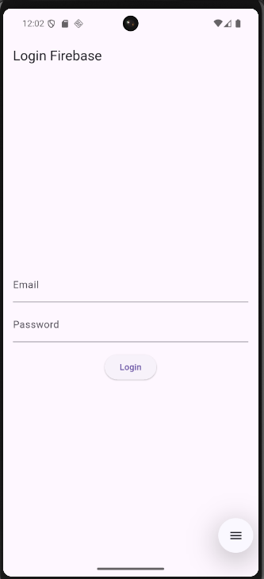
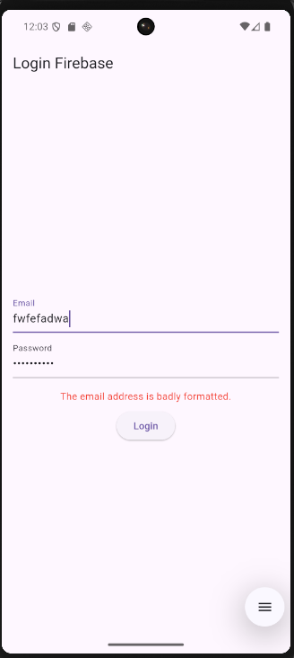
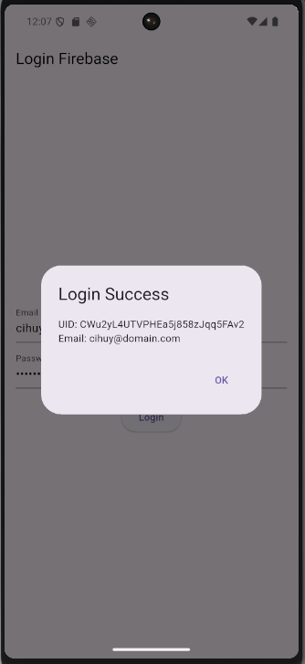

# Latihan Flutter Firebase - Login Authentication

Sebuah aplikasi Flutter pembelajaran yang mendemonstrasikan integrasi Firebase Authentication dengan fitur login email dan password.

**Penulis:** Radja Satrio Seftiano  
**NIM:** 1123150172

---

## 📱 Screenshots

|            Tampilan Awal             |              Validasi Email              |            Login Berhasil             |
| :----------------------------------: | :--------------------------------------: | :-----------------------------------: |
|  |  |  |

---

## ✨ Fitur

- ✅ Login dengan email dan password
- ✅ Validasi input email
- ✅ Error handling dari Firebase Authentication
- ✅ Loading state indicator
- ✅ Display user UID dan email setelah login berhasil
- ✅ Support Android dan Web platform

---

## 🚀 Persyaratan

Sebelum menjalankan project ini, pastikan Anda telah menginstal:

- **Flutter SDK** (v3.9.2 atau lebih tinggi)
- **Dart SDK** (sudah included dengan Flutter)
- **Android SDK** (untuk Android development)
- **Firebase CLI** (untuk konfigurasi Firebase)
- **Git** (untuk version control)

Verifikasi instalasi:

```bash
flutter --version
dart --version
flutterfire --version
```

---

## 📋 Step by Step - Cara Menjalankan Project

### 1. Clone Repository

```bash
git clone <repository-url>
cd latihan_flutter_firebase
```

### 2. Install Dependencies

```bash
flutter pub get
```

### 3. Konfigurasi Firebase (Jika Belum Ada)

#### Langkah a: Login ke Firebase CLI

```bash
firebase login
```

#### Langkah b: Konfigurasi dengan FlutterFire

```bash
flutterfire configure
```

Pilih opsi:

- Pilih project Firebase yang sesuai
- Pilih platform: Android dan Web
- Ikuti prompt untuk konfigurasi setiap platform

### 4. Verifikasi Konfigurasi

Pastikan file berikut sudah ada dan ter-generate:

- `lib/firebase_options.dart` - Konfigurasi Firebase platform
- `android/app/google-services.json` - Konfigurasi Android Firebase

### 5. Jalankan Project

#### Untuk Android (Emulator atau Device)

```bash
flutter run
```

#### Untuk Web

```bash
flutter run -d chrome
```

#### Untuk Platform Spesifik

```bash
flutter run -d windows    # Windows
flutter run -d macos      # macOS
flutter run -d linux      # Linux
```

### 6. Test Login

Gunakan kredensial yang sudah terdaftar di Firebase:

- **Email:** masukkan email terdaftar
- **Password:** masukkan password yang sesuai
- **Klik:** Login button

---

## 🔧 Struktur Project

```
lib/
├── main.dart                 # Entry point & Firebase initialization
├── firebase_options.dart     # Platform-specific Firebase config (auto-generated)
└── pages/
    └── login_page.dart       # Login UI & Authentication logic

android/
├── app/
│   ├── build.gradle.kts      # Gradle configuration with Google Services plugin
│   └── google-services.json  # Firebase Android config (auto-generated)
└── build.gradle.kts          # Root Gradle config

pubspec.yaml                  # Dependencies & project metadata
firebase.json                 # FlutterFire CLI configuration
```

---

## 📦 Dependencies

Aplikasi ini menggunakan dependencies berikut:

```yaml
dependencies:
  flutter:
    sdk: flutter
  firebase_core: ^4.2.1 # Firebase Core Library
  firebase_auth: ^6.1.2 # Firebase Authentication
  cupertino_icons: ^1.0.8 # iOS style icons

dev_dependencies:
  flutter_test:
    sdk: flutter
  flutter_lints: ^5.0.0 # Linting rules
```

---

## 🔐 Firebase Setup - Petunjuk Detail

### 1. Buat Project di Firebase Console

1. Kunjungi [Firebase Console](https://console.firebase.google.com)
2. Klik "Buat Project Baru"
3. Masukkan nama project: `myappmobile-8a3c1` (atau nama pilihan Anda)
4. Aktifkan Google Analytics (opsional)
5. Buat project

### 2. Aktifkan Firebase Authentication

1. Di Firebase Console, pilih project Anda
2. Klik menu **Authentication** di sidebar
3. Klik tab **Sign-in method**
4. Aktifkan **Email/Password** provider
5. Klik **Save**

### 3. Buat Test Account

1. Di Firebase Console → Authentication → Users
2. Klik **Add User**
3. Masukkan email: contoh@example.com
4. Masukkan password: minimal 6 karakter
5. Klik **Add User**

### 4. Download Config Files

```bash
# Semua sudah otomatis dengan flutterfire configure
# Jika manual:
# - Download google-services.json untuk Android
# - Simpan di: android/app/google-services.json
```

---

## 🧪 Testing

### Jalankan Widget Tests

```bash
flutter test
```

### Testing Manual Login

**Case 1: Login Berhasil**

- Email: test@example.com (terdaftar di Firebase)
- Password: password123
- Expected: Dialog menampilkan UID & email

**Case 2: Email Tidak Valid**

- Email: invalidema il
- Password: password123
- Expected: Error message "The email address is badly formatted."

**Case 3: Password Salah**

- Email: test@example.com
- Password: wrongpassword
- Expected: Error message "The password is invalid or the user does not have a password."

**Case 4: Akun Tidak Terdaftar**

- Email: notregistered@example.com
- Password: password123
- Expected: Error message "There is no user record corresponding to this identifier."

---

## 🐛 Troubleshooting

### Error: "DefaultFirebaseOptions have not been configured"

**Solusi:**

```bash
flutterfire configure
```

### Error: "google-services.json not found"

**Solusi:**

- Pastikan file ada di `android/app/google-services.json`
- Jalankan ulang: `flutterfire configure`

### Error: "Failed to sign in with email and password"

**Solusi:**

- Verifikasi email dan password di Firebase Console
- Pastikan Email/Password provider sudah diaktifkan di Firebase Authentication

### Build Cache Issues

**Solusi:**

```bash
flutter clean
flutter pub get
flutter run
```

### Android Gradle Issues

**Solusi:**

```bash
cd android
./gradlew clean
cd ..
flutter clean
flutter run
```

---

## 📝 Catatan Penting

### Platform Support

Saat ini project ini dikonfigurasi untuk:

- ✅ **Android** - Fully supported
- ✅ **Web** - Fully supported
- ❌ **iOS** - Belum dikonfigurasi
- ❌ **macOS** - Belum dikonfigurasi
- ❌ **Windows** - Belum dikonfigurasi
- ❌ **Linux** - Belum dikonfigurasi

Untuk menambah platform: jalankan `flutterfire configure` dan pilih platform tambahan.

### Security Notes

⚠️ **Perhatian:**

- File `lib/firebase_options.dart` berisi API keys
- File `android/app/google-services.json` berisi konfigurasi sensitif
- Jangan commit credential files ke repository publik
- Gunakan Firebase Security Rules untuk melindungi data

---

## 📄 License

Project ini dibuat untuk keperluan pembelajaran.

---

**Dibuat oleh:** Radja Satrio Seftiano  
**NIM:** 1123150172  
**Tanggal:** 06 Desember 2025
